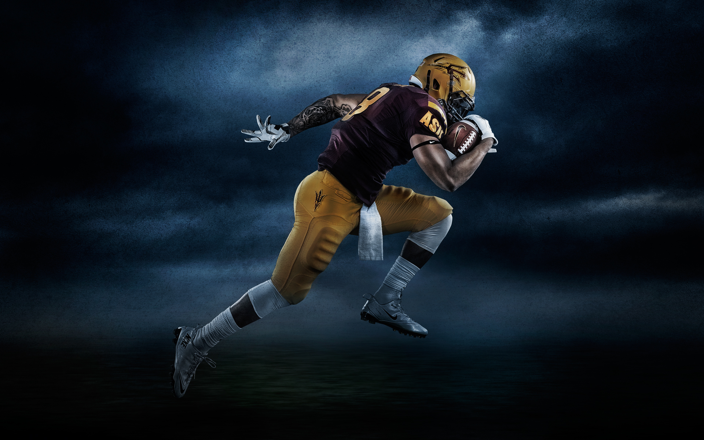
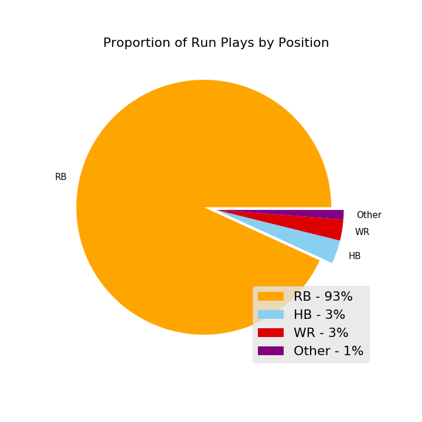
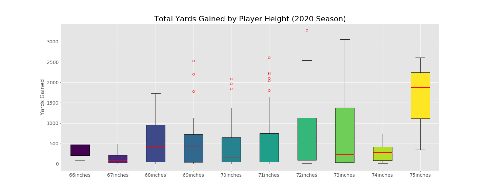

# NFL Rushing Yards

> [*image source: Picserio*](https://picserio.com/american-football-player-wallpaper/4586461.html) 

 

This project contains the analysis of the aspects that make a run play successful, and a model that can predict the yards that will be gained on the next run play. All of the data used can be found [here](https://www.kaggle.com/c/nfl-big-data-bowl-2020/overview)  
The ticket sales, corporate sposnors and concessions can contribute to over ***50%*** of a teams annual revenue and a teams fan base is a large driver of these profitable transasctions. A winning team can attract new fans and appease exiting ones; and more fans can create larger profit margins. This project aims to assist NFL teams in their play calling effectiveness and increase their odds of winning.  
[Add a link to the pesentation (online/google docs)]()

   
You can find me on: 
- [My Email](Louisbademosi@gamil.com)
- [My LinkedIn](https://www.linkedin.com/in/louis-bademosi-1bb964195/)
- [My Articles](https://medium.com/@louisbademosi_20360)

   
## Table of contents

1. [Executive Summary](#exec_summary)
2. [The Data](#the_data)
3. [Exploratory Analysis](#explore_analysis)
4. [The Model](#model)
5. [Future Improvements](#future_improv)
6. [Repository Navigation](#repo_nav)
7. [Technologies Used](#tech_used)
8. [Helpful Resources](#help_resource)

## Executive Summary

#### The aims:
1. *To utilise statistical analysis in order to provide a better understanding of what contributes to a successful run play.*
2. *To build a model that will predict the yards gained by the next run play.*

#### Why this matters:
1. *NFL teams are franchises, and winning teams can generate more profits*

    NFL teams are franchises. Because of this, like any other franchise or business, the bottom line often comes down to its profits and the annual increase of those profits. The National Football League split their revenue into two categories: 'national revenue' and 'local revenue'. The national revenue, consists of the profits made by the NFL by way of licensing and merchandising deals. These profits are then evenly distributed among each of the 32 NFL teams.  
    
    Conversely, the local revenue generated from ticket sales, corporate sponsors and concessions are earned by the teams themselves. According to an [article](https://www.forbes.com/sites/robreischel/2018/07/16/green-bay-packers-enjoy-another-year-of-record-revenue/#4347ecae14bb) on Forbes Business, in 2018 the Green Bay Packers *"local revenue increased to 199 million dollars"* accounting for around ***44%*** of their total revenue that year. Teams that generate more of a fan following, and in turn a larger scope of influence will have more bargaining power for these streams of local revenue. In addition to the potential profits from winning the playoffs and becoming the league champions, a winning team stands more chance of a greater fan following and thus greater potential for an increase in profit margins.

2. *A dominant run game can win games*

    To win you need to score, to score you need to get the ball into the end zone, and to get the ball into the end zone you need to move the ball farther up the field. With a run play being one out of the two options an offence has to try and move closer to the end zone, optimising this aspect of their game could lead to considerable improvements in a teams win percentage. In an [article](https://www.nfl.com/news/running-the-football-still-works-plus-the-amari-cooper-effect-0ap3000000996948) by the renowned NFL analyst, former player and scout, Bucky Brooks states that:  
    *“From Weeks 11-13, teams that ranked in the top half of the NFL in terms of run-play percentage posted a combined record of 32-13 (71.1 winning percentage). On the flip side, teams that ranked in the bottom half of the league in this category logged a combined mark of 12-31 (27.9)”*  

In this project I have provided insightful analysis into the aspects of a successful run game and designed a model that will predict the yards gained on the next run play. The implementation of such a model is expected to improve the play calling efficiency of an offensive team and as a result lead to an increased win percentage. 

> For more literature on this see:  
Business Opportunities' - [It’s True: NFL Teams Really Are Franchises](https://www.business-opportunities.biz/2013/10/20/nfl-teams-are-franchises-too/)  
CNBC's  - [How NFL Teams Make money](https://www.cnbc.com/2018/10/05/nfl-owners-teams-football.html)    
And for a beginner's guide to the sport:  
The NFL's - [A Beginner's Guide to American Football](https://www.youtube.com/watch?v=3t6hM5tRlfA)

## The Data

We can see here that almost all of the runs in the dataset are by the Running Backs on the offense, contributing to 93% of the total run plays. It could be argued that this should be rounded to 96% as the HB (Half Back) position is a specific type of running back.  

This to be expected as running with the ball (as the name suggests) is the RB's primary role on the team. Because of this the modelling of the data will be based on the cases where it is the RB who is running with the ball and any other player who ran with the ball will be treated as an edge case.
 

## Exploratory Analysis

Surprisingly the median number of yards ran for by each of the Running Backs in each height category is largely identical; with all of them ranging from 100 to 400 yards in the season. What is also interesting to note, is how the range in the categories increases with the height of the player. As if to say that most Running Backs will run for around 300 yards regardless of their height, but a few Running Backs will have great seasons rushing for over 2,000 yards. Unless they are under 69 inches, in which case they will have close to no chance of rushing for more than 1,500 yards.  
With all of this it should also be taken into consideration that the categories below 68 inches and above 73 inches are largely under represented in comparison. This could cause them to be less reliable examples of the expected performance of players in that height category.

## The Model & Project Conclusion

The performance of all the models are unsatisfactory, but the performance of the baseline model and the ridge regression model are tied for the best performances. Because the difference between the two is in the implementation of a penalty term (the ridge regression model) and as a result a decreased tendency towards high varioation in performance; I have deemed it not neccesary to use ridge regression at all seeing as both models are massively underfit. In addition, ridge regression is also effective in circumventing the predictive variance that can be caused by small datasets. This is also not necessary as the dataset used is not particularly small with just under 30,000 observations. For these reasons the baseline model is my choice of the three. 

In conclusion, none of iterations of the linear regression model have shown to have a good level of performane with all of them explaining less than ***1%*** of the variation in both the training data and the validation data. This is largely due to the fact that a linear regression model is based on four fundamental assumptions: 
1. Linear relationship between the independent and dependent variables
2. No multicolinearity between the independent variables
3. Homoscedasticity of the error
4. Normal distribution of error 
 

As the earlier EDA has shown, the relationships between the features used and the ouput of the model are not linear nor are the errors homoscedastic in nature. 
 

Also, in each of the iterations a different regularisation method had been used. Considering that regularisation is a means to increase a model's bias in the hopes of avoiding high variation in the model's out of sample predictive performance; none of the regularisation methods above will improve the model's performance since it's predictive power is so low anyway i.e there are very slim chances that the issue is an over-fitting problem, due to the fact the model doesn't explain the training data at all! Let alone explain it too accurately.  
Because of this, a non-linear model such as a decision tree regressor, random forest model or artificial neural net is likely to have a much better predicting the yards gained on each play.

> see this [article](https://towardsdatascience.com/assumptions-of-linear-regression-algorithm-ed9ea32224e1) from Towards Data Science for more literature on the assumptions of linear regression

## Future Improvements

As far as the exploratory analysis is concerned, there is much much more to explore! With the dataset having 48 features, the relationships between these features could give more insight into the trends and patterns in the data. As an example, I would like to use the "Week" feature in the dataset and run some time series analysis to uncover some temporal trends in the data.  
As far as the modelling process is concerned: firstly,  I will like to see if there are any features in the data that do meet the requirments of linear regression so that I can gain a true sense of the models effectiveness. Secondly, I will like to utilise other non-linear models such as a decision tree regressor or an anrtificial neural net.

## Repository Navigation

The keys files can be found here:  
- [Main Notebook](https://github.com/Louis-Bad/NFL-Rushing-Yards/blob/master/main.ipynb)
- [Presentation -- add link --]() 

## Technologies Used
- Pandas 
- Matplotlib
- Seaborn
- Numpy 
- SciKit Learn

## Helpful Resources

- NFL YouTube - [Beginners Guide to American Football](https://www.youtube.com/watch?v=3t6hM5tRlfA)
- Business Opportunities - [NFL teams are franchises](https://www.business-opportunities.biz/2013/10/20/nfl-teams-are-franchises-too/)
- Investopedia - [How the NFL Makes Money](https://www.cnbc.com/2018/10/05/nfl-owners-teams-football.html)
- CNBC  - [How NFL Teams Make money](https://www.youtube.com/watch?v=-RUtxxMUDd8)
- Forbes - [Green Bay Packers 2018 Revenue](https://www.forbes.com/sites/robreischel/2018/07/16/green-bay-packers-enjoy-another-year-of-record-revenue/#4347ecae14bb)
- NFL - [Running the Football still works](https://www.nfl.com/news/running-the-football-still-works-plus-the-amari-cooper-effect-0ap3000000996948)
- ESPN - [Overprotected Quarter Backs](https://www.espn.com/nfl/story/_/id/10007640/nfl-overprotects-quarterbacks-good-reason)
- Windy City Gridiron - [End-around, Jet sweep and  Reverse plays](https://www.windycitygridiron.com/2014/11/5/7132567/football-101-difference-between-a-jet-sweep-an-end-around-reverse)
- Towards Data Science [Assumptions of Linear Regression](https://towardsdatascience.com/assumptions-of-linear-regression-algorithm-ed9ea32224e1)
    
            
            
            
            
